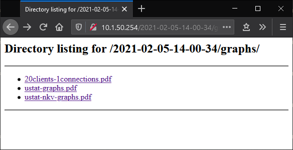

# TESS on VM Tutorial

## Overview

Ansible automation for configuring systems and orchestrating deployment of TESS software.

## Pre-deployment

### VM Setup and Configuration

* ESXi 7.0.0 with Enterprise Plus or Evaluation license
* vCenter Server Appliance with Standard or Evaluation license


Suggested ESXi specifications:

        CPU: Intel(R) Xeon(R) CPU E5-2696 v4 @ 2.20GHz
        Cores: 22 cores per socket,
        CPU sockets: 2
        HyperThreading: Enabled
        Memory: 512G (DDR4)

Suggested ESXi storage:

        Minimum 1TB SSD for local datastore

Guest VM Specification:

        VM Hardware version: 17
        OS guest: CentOS 7.9
        CPU: 6 cores
        mem: 32 GB
        boot / OS disk: default
        boot disk controller: paravirtual
        management NIC (TCP): VMXnet3
        RDMA back-end NIC: PVRDMA
        data disk: 50GB+ thick provisioned
        data disk controller: Virtual NVMe

In guest OS:

* Configure IPs for management network (TCP) and back-end traffic (RDMA)
* Set MTU for PVRDMA interface to 9000
* Kernel 5.1 must have PVRDMA driver compiled (included in the bundle, automatically installed by Ansible)

For complete documentation for PVRDMA vSphere and guest VM configuration, please refer to VMware and Mellenox documentation.

<https://docs.vmware.com/en/VMware-vSphere/7.0/com.vmware.vsphere.networking.doc/GUID-4A5EBD44-FB1E-4A83-BB47-BBC65181E1C2.html>

<https://docs.mellanox.com/pages/releaseview.action?pageId=15055422>

### Ansible Host Setup

#### *Linux Packages*

On a linux host, install Ansible version 2.9.12 using python3. Do not use a package-manager version of Ansible.

     yum install -y python3
     curl <https://bootstrap.pypa.io/get-pip.py> -o get-pip.py
     python3 get-pip.py
     python3 -m pip install ansible==2.9.12

### Download Deployment Bundle

Download the deployment bundle to the Ansible host.

## VM Cluster Setup

Clusters with 4 and 10 VM nodes are supported, and have been tested.

### Enable Ansible SSH to Cluster

Ensure Ansible can access all VMs in the cluster.

#### *Add Ansible user*

A user should be provisioned on all hosts in the cluster with "NOPASSWD" sudo access.
Ansible will use this account for all automated configuration.
Alternatively, the root user can be used instead.

#### *Generate SSH key*

Generate SSH key on Ansible host, unless already generated.

        #ssh-keygen
        Generating public/private rsa key pair.
        Enter file in which to save the key (/home/ylo/.ssh/id_rsa):
        Enter passphrase (empty for no passphrase):
        Enter same passphrase again:
        Your identification has been saved in id_rsa.
        Your public key has been saved in id_rsa.pub.
        The key fingerprint is:
        SHA256:GKW7yzA1J1qkr1Cr9MhUwAbHbF2NrIPEgZXeOUOz3Us user@host
        The key's randomart image is:
        +---[RSA 2048]----+
        |.*++ o.o.        |
        |.+B + oo.        |
        | +++ *+.         |
        | .o.Oo.+E        |
        |    ++B.S.       |
        |   o * =.        |
        |  + = o          |
        | + = = .         |
        |  + o o          |
        +----[SHA256]-----+

#### *Copy key for ansible login*

Copy ssh key to each of the hosts using the shh-copy-id command.

        ssh-copy-id ansible@testhost01.domain.com

To copy keys to 10 hosts automatically:

        for i in {01..10}; do sshpass -p "ansible" ssh-copy-id -o StrictHostKeyChecking=no ansible@testhost${i}.domain.com; done

#### *Test cluster nodes for ansible login*

To confirm the ssh key copy, test if you can login to the hosts using ssh without the password.

### Prepare Inventory File

Configure an Ansible inventory file for the cluster.
Below is an example inventory file defining a cluster of 10 TESS servers, with one also used as a client.

        [servers]
        msl-ssg-vm11.msl.lab tcp_ip_list="['10.1.51.35']" rocev2_ip_list="['192.168.199.11']"
        msl-ssg-vm12.msl.lab tcp_ip_list="['10.1.51.38']" rocev2_ip_list="['192.168.199.12']"
        msl-ssg-vm13.msl.lab tcp_ip_list="['10.1.51.58']" rocev2_ip_list="['192.168.199.13']"
        msl-ssg-vm14.msl.lab tcp_ip_list="['10.1.51.24']" rocev2_ip_list="['192.168.199.14']"
        msl-ssg-vm15.msl.lab tcp_ip_list="['10.1.50.230']" rocev2_ip_list="['192.168.199.15']"
        msl-ssg-vm16.msl.lab tcp_ip_list="['10.1.50.235']" rocev2_ip_list="['192.168.199.16']"
        msl-ssg-vm17.msl.lab tcp_ip_list="['10.1.50.226']" rocev2_ip_list="['192.168.199.17']"
        msl-ssg-vm18.msl.lab tcp_ip_list="['10.1.50.227']" rocev2_ip_list="['192.168.199.18']"
        msl-ssg-vm19.msl.lab tcp_ip_list="['10.1.50.234']" rocev2_ip_list="['192.168.199.19']"
        msl-ssg-vm20.msl.lab tcp_ip_list="['10.1.50.232']" rocev2_ip_list="['192.168.199.20']"
        [clients]
        msl-ssg-vm11.msl.lab
        [all:vars]
        ansible_user=ansible
        target_fw_version=1.0
        dss_target_mode=kv_block_vm
        minio_ec_block_size=524288

## Install and Start DSS Software Stack

### First time Deployment

* Configure VMs

    ```ansible-playbook -i your_inventory playbooks/configure_vms.yml```

* Deploy TESS:  Deploy and start TESS software stack

    ```ansible-playbook -i your_inventory playbooks/deploy_dss_software.yml```


### Other Useful Playbooks

* Stop the TESS software stack

    ```ansible-playbook -i your_inventory playbooks/stop_dss_software.yml```

* Start the TESS software stack

    ```ansible-playbook -i your_inventory playbooks/start_dss_software.yml```

* Uninstall the TESS software stack

    ```ansible-playbook -i your_inventory playbooks/remove_dss_software.yml```

* Restart the TESS software stack

    ```ansible-playbook -i your_inventory playbooks/restart_dss_software.yml```

* Clean and Stop the MinIO instances
Clear MinIO metadata, and restart MinIO instances (results in data loss).

    ```ansible-playbook -i your_inventory playbooks/cleanup_dss_minio.yml```

* Debug DSS software
Check for running target and MinIO instances, and search for errors in logs

    ```ansible-playbook -i your_inventory playbooks/debug_dss_software.yml```

* Format and redeploy DSS Software
Remove TESS software, formats data disks, and re-install TESS software.

    ```ansible-playbook -i your_inventory playbooks/format_redeploy_dss_software.yml```

* Format and restart the software
Format data disks, and restart TESS software.

    ```ansible-playbook -i your_inventory playbooks/format_restart_dss_software.yml```

* Upgrade TESS software, leaving data in-tact.

    ```ansible-playbook -i your_inventory playbooks/upgrade_dss_software.yml```

## Testing DSS Software Stack

### AI benchmark

#### *Execute AI Benchmark*

    cd ~/deploy
    ansible-playbook -i your_inventory playbooks/start_dss_benchamrk.yml

#### *View Benchmark Results*

From a web browser, navigate to the TCP IP of the first host in the `clients` group.
Benchmark results can be found under the dated directory corresponding with the benchmark run, under "graphs":



### S3-benchmark

s3-benchmark is a performance testing tool that can check the performing S3 operations (PUT, GET, and DELETE) for object storage.
s3-benchmark is automatically installed by Ansible to "/usr/dss/nkv-minio/s3-benchmark" on each VM node.

#### *Command Line Arguments*

Below is the command line arguments to use S3-Benchmark displayed using help:

        /usr/dss/nkv-minio/s3-benchmark -h
        Wasabi benchmark program v2.0
        Usage of myflag:
        -a string
            Access key
        -b string
            Bucket for testing (default "wasabi-benchmark-bucket")
        -c int
            Number of object per thread written earlier
        -d int
            Duration of each test in seconds (default 60)
        -l int
            Number of times to repeat test (default 1)
        -n int
            Number of IOS per thread to run
        -o int
            Type of op, 1 = put, 2 = get, 3 = del
        -p string
            Key prefix to be added during key generation (default "s3-bench-minio")
        -r string
            Region for testing (default "us-east-1")
        -s string
            Secret key
        -t int
            Number of threads to run (default 1)
        -u string
            URL for host with method prefix (default "http://s3.wasabisys.com")
        -z string
        Size of objects in bytes with postfix K, M, and G (default "1M")

#### *Example S3-Benchmark*

Here is an example run of the benchmark for 100 threads with the default 1MB object size. The benchmark reports each operation's PUT, GET and DELETE results in terms of data speed and operations per second. The program writes all results to the log file benchmark.log.
We want to highlight that data volume written should not exceed 50% of the subsystem in VM environment. For example, 1000 object with 1MB size thread number is limited to 256.

Note: After writing data in the storage and before reading the data, it is necessary to run compaction command. Compaction allows obtaining the software's accurate and optimal performance.  

* Put Data

        /usr/dss/nkv-minio/s3-benchmark -a minio -b testbucket -s minio123 -u <http://10.1.51.21:9000> -t 100 -z 1M -n 100 -o 1
        Wasabi benchmark program v2.0Parameters: url=<http://10.1.51.21:9000>, bucket=testbucket, region=us-east-1, duration=60, threads=100, num_ios=100, op_type=1, loops=1, size=1M
        2021/01/05 18:22:52 WARNING: createBucket testbucket error, ignoring BucketAlreadyOwnedByYou: Your previous request to create the named bucket succeeded and you already own it.
        status code: 409, request id: 1657835058733E40, host id:
        Loop 1: PUT time 38.9 secs, objects = 10000, speed = 2.5GB/sec, 257.1 operations/sec. Slowdowns = 0

* Run Compaction

        cd /root/deploy
        ansible-playbook playbooks/start_compaction.yml

* Get Data
  
        /usr/dss/nkv-minio/s3-benchmark -a minio -b testbucket -s minio123 -u http://10.1.51.21:9000 –t 100 -z 1M -n 100 -o 2
        Wasabi benchmark program v2.0Parameters: url=http://10.1.51.21:9000, bucket=testbucket, region=us-east-1, duration=60, threads=100, num_ios=100, op_type=2, loops=1, size=1M
        2021/01/05 18:23:39 WARNING: createBucket testbucket error, ignoring BucketAlreadyOwnedByYou: Your previous request to create the named bucket succeeded and you already own it.
        status code: 409, request id: 1657835B38D61A94, host id:
        Loop 1: GET time 14.9 secs, objects = 10000, speed = 6.6GB/sec, 672.1 operations/sec. Slowdowns = 0

* Delete Data

        /usr/dss/nkv-minio/s3-benchmark -a minio -b testbucket -s minio123 -u <http://10.1.51.21:9000> –t 100 -z 1M -n 100 -o 3
        Wasabi benchmark program v2.0Parameters: url=<http://10.1.51.21:9000>, bucket=testbucket, region=us-east-1, duration=60, threads=100, num_ios=100, op_type=3, loops=1, size=1M
        2021/01/05 18:24:04 WARNING: createBucket testbucket error, ignoring BucketAlreadyOwnedByYou: Your previous request to create the named bucket succeeded and you already own it.
        status code: 409, request id: 16578360FD53602A, host id:
        Loop 1: DELETE time 4.3 secs, 2342.4 deletes/sec. Slowdowns = 0

### MinIO mc tool

The MinIO mc client is installed under "/usr/dss/nkv-minio/mc", and the DSS cluster is automatically registered with alias "autominio"

* Set of available command on mc tool

        /usr/dss/nkv-minio/mc -h

        COMMANDS:
        ls       list buckets and objects
        mb       make a bucket
        rb       remove a bucket
        cp       copy objects
        mirror   synchronize object(s) to a remote site
        cat      display object contents
        head     display first 'n' lines of an object
        pipe     stream STDIN to an object
        share    generate URL for temporary access to an object
        find     search for objects
        sql      run sql queries on objects
        stat     show object metadata
        tree     list buckets and objects in a tree format
        du       summarize disk usage folder prefixes recursively
        diff     list differences in object name, size, and date between two buckets
        rm       remove objects
        event    configure object notifications
        watch    listen for object notification events
        policy   manage anonymous access to buckets and objects
        admin    manage MinIO servers
        session  resume interrupted operations
        config   configure MinIO client
        update   update mc to latest release
        version  show version info
        
        GLOBAL FLAGS:
        --autocompletion              install auto-completion for your shell
        --config-dir value, -C value  path to configuration folder (default: "/opt/ansible/.mc")
        --quiet, -q                   disable progress bar display
        --no-color                    disable color theme
        --json                        enable JSON formatted output
        --debug                       enable debug output
        --insecure                    disable SSL certificate verification
        --help, -h                    show help
        --version, -v                 print the version

* To list objects on DSS cluster using mc:

        /usr/dss/nkv-minio/mc ls autominio
        [2021-02-05 12:19:18 PST] 0B benchmark-bucket-1/

### Client Components

The client library and data mover are provided to load data into the cluster from an NFS share.

* Client Library: please refer to its README file and the run example under dss_client directory.

* Data Mover:Installing the data mover is possible by executing the following playbook using Ansible.

```ansible-playbook -i your_inventory playbooks/deploy_datamover.yml```

Complete documentation is available under the /usr/dss/nkv-datamover directory.

## Known Issues
 Data volume written in VM environment
 * should not exceed 50% of subsystem capacity 
 * should not exceed 256 concurrent threads
 

